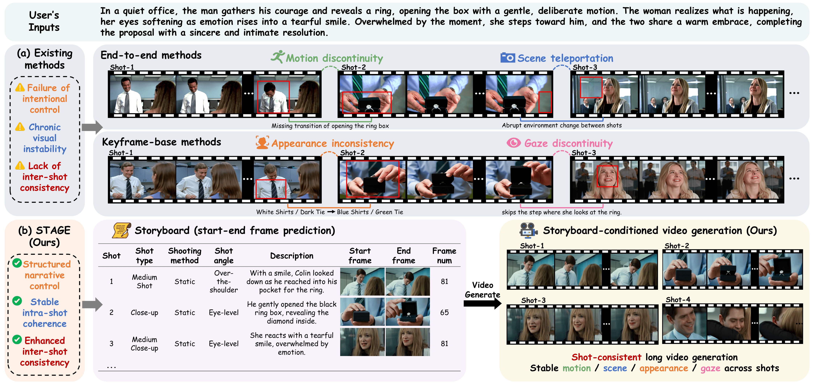

<div align="center">

# STAGE: Storyboard-Anchored Generation for Cinematic Multi-shot Narrative

</div>

<div align="center">

Peixuan Zhang,
Zijian Jia,
Kaiqi Liu,
Shuchen Weng,
Si Li,
Boxin Shi

<a href="https://arxiv.org/abs/2512.12372"></a>

</div>



## Abstract

**STAGE** is a storyboard-anchored workflow for cinematic multi-shot video generation.

<details><summary>CLICK for the full abstract</summary>
While recent advancements in generative models have achieved remarkable visual fidelity in video synthesis, creating coherent multi-shot narratives remains a significant challenge. To address this, keyframe-based approaches have emerged as a promising alternative to computationally intensive end-to-end methods, offering the advantages of fine-grained control and greater efficiency. However, these methods often fail to maintain cross-shot consistency and capture cinematic language. In this paper, we introduce STAGE, a SToryboard-Anchored GEneration workflow to reformulate the keyframe-based multi-shot video generation task. Instead of using sparse keyframes, we propose STEP2 to predict a structural storyboard composed of start-end frame pairs for each shot. We introduce the multi-shot memory pack to ensure long-range entity consistency, the dual-encoding strategy for intra-shot coherence, and the two-stage training scheme to learn cinematic inter-shot transition.
</details>

## 💡 Change log

- 2026.2.27 Release Project Page and Paper!

## 📑 Todo List

- [ ] Release ConStoryBoard dataset
- [ ] Release ConStoryBoard-HP dataset
- [ ] Release inference code and checkpoint
- [ ] Release training code
- [ ] Release DPO training code

## Citation

```bibtex
@article{zhang2025stage,
    title={STAGE: Storyboard-Anchored Generation for Cinematic Multi-shot Narrative},
    author={Peixuan Zhang and Zijian Jia and Kaiqi Liu and Shuchen Weng and Si Li and Boxin Shi},
    journal={arXiv preprint arXiv:2512.12372},
    year={2025}
}
```
