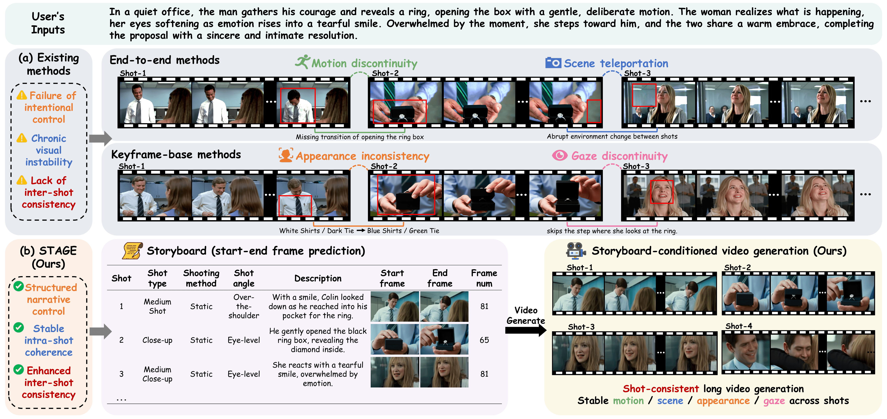

<div align="center">

# STAGE: Storyboard-Anchored Generation for Cinematic Multi-shot Narrative

</div>

<div align="center">

Peixuan Zhang,
Zijian Jia,
Kaiqi Liu,
Shuchen Weng,
Si Li,
Boxin Shi

<a href="https://arxiv.org/abs/2512.12372"></a>
<a href="https://huggingface.co/escapist413/STAGE"></a>
<a href="https://www.163.com/dy/article/KON596640511AQHO.html"></a>

</div>



## Abstract

**STAGE** is a storyboard-anchored workflow for cinematic multi-shot video generation.

<details><summary>CLICK for the full abstract</summary>
While recent advancements in generative models have achieved remarkable visual fidelity in video synthesis, creating coherent multi-shot narratives remains a significant challenge. To address this, keyframe-based approaches have emerged as a promising alternative to computationally intensive end-to-end methods, offering the advantages of fine-grained control and greater efficiency. However, these methods often fail to maintain cross-shot consistency and capture cinematic language. In this paper, we introduce STAGE, a SToryboard-Anchored GEneration workflow to reformulate the keyframe-based multi-shot video generation task. Instead of using sparse keyframes, we propose STEP2 to predict a structural storyboard composed of start-end frame pairs for each shot. We introduce the multi-shot memory pack to ensure long-range entity consistency, the dual-encoding strategy for intra-shot coherence, and the two-stage training scheme to learn cinematic inter-shot transition.
</details>

## 💡 News

- 2026.2.27 Release Project Page and Paper!
- 2026.3.31 Release open-source inference code.

## 📑 Todo List

- [x] Release inference code
- [x] Release inference checkpoint
- [ ] Release ConStoryBoard dataset
- [ ] Release ConStoryBoard-HP dataset
- [ ] Release training code
- [ ] Release DPO training code

## 📥 Download

You can find the pre-trained checkpoints in our [Hugging Face Repository](https://huggingface.co/escapist413/STAGE).

### Run

```bash
./run.sh \
  --dit /path/to/STAGE/unet/unet.safetensors \
  --vae /path/to/STAGE/vae/diffusion_pytorch_model.safetensors \
  --text_encoder /path/to/STAGE/text_encoder/model-00001-of-00004.safetensors \
  --tokenizer_path /path/to/STAGE/tokenizer \
  --processor_path /path/to/STAGE/processor \
  --network_module musubi_tuner.networks.lora_qwen_image \
  --network_weights /path/to/STAGE/lora.safetensors \
  --from_json ./examples/input_example.json \
  --save_path ./output \
  --height 864 \
  --width 1536 \
  --infer_steps 20 \
  --guidance_scale 4.0 \
  --flow_shift 2.2 \
  --seed 42
```

### JSON Input Format

```json
[
  {
    "idx": 11,
    "prompt": "...",
    "control_img_list": ["/abs/path/img1.png", "/abs/path/img2.png"],
    "negative_prompt": " ",
    "seed": 123
  }
]
```

### Output

Each sample generates:

- `save_path/{idx}_f.png`
- `save_path/{idx}_l.png`

## Citation

```bibtex
@article{zhang2025stage,
    title={STAGE: Storyboard-Anchored Generation for Cinematic Multi-shot Narrative},
    author={Peixuan Zhang and Zijian Jia and Kaiqi Liu and Shuchen Weng and Si Li and Boxin Shi},
    journal={arXiv preprint arXiv:2512.12372},
    year={2025}
}
```
